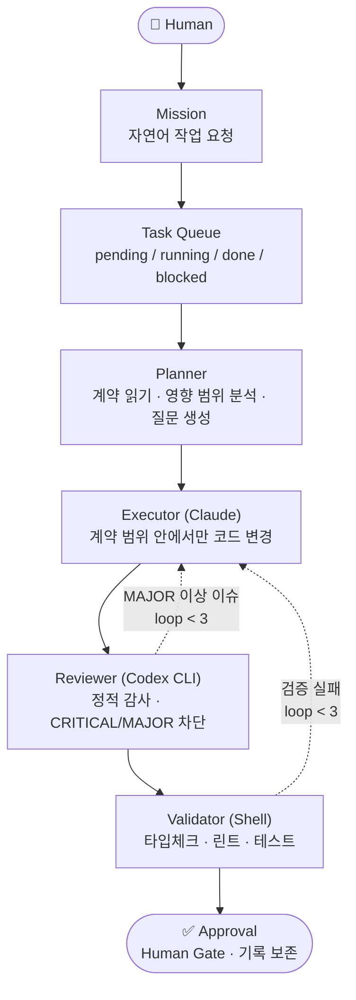

# HCHAIN


> AI Task Harness Framework — Contract First, Human Approved · v0.1.0

**One Mission Contract → Multiple Tasks → One Implementation Report**

사람이 Mission Contract를 한 번 정의하면, HCHAIN이 이를 실행 가능한 Task들로 분해하고,
각 Task를 계약된 파이프라인(PLAN → RESEARCH → ACTION → REVIEW → VALIDATE → DONE)으로 실행한 뒤,
하나의 Implementation Report로 결과를 돌려준다.

---

## HCHAIN이 해결하려는 문제

처음엔 내가 GPT↔Claude 사이의 메신저였다. GPT가 프롬프트를 작성하고, Claude가 코딩하고, 다시 GPT가 결과를 분석하는 루프를 **사람이 직접 중계**했다. "고쳐줘 / 다시 확인해줘 / 테스트 했어?" — 매번 말로 지시해야 했고 같은 실수가 반복됐다.

| 문제 | 증상 |
|------|------|
| Human Bottleneck | 모든 AI 전환점에서 사람이 직접 중계 |
| Task Feedback Latency | 구현 → 검토 → 수정 사이클이 모두 수동 |
| Silent Failure | AI가 "겉으론 되는데 실행하면 깨지는" 코드를 조용히 생성 |
| Scope Drift | AI가 영향 범위를 모른 채 관련 없는 코드까지 수정 |
| No Audit Trail | 무엇을 왜 변경했는지 추적 불가 |

ai-video 프로젝트(API·DB·Worker·Queue·TTS·Scene·Render·재기동 복구)를 구축하면서, AI가 겉으론 동작하는 코드를 만들지만 실제로 실행하면 중간에서 깨지는 경험을 여러 번 했다.

**더 근본적인 문제**: AI는 "무엇을 만들 것인가"를 명확히 이해하기 전에 코드를 작성하는 경향이 있다. 영향 범위를 모른 채 수정하고, 빠진 정책은 무시하고, 기존 계약과 충돌하는 코드를 추가했다.

---

## HCHAIN의 핵심 아이디어

**"긴 프롬프트"가 아니라 "Mission Contract"다.**

AI에게 일을 시키는 일반적인 방법은 프롬프트를 잘 쓰는 것이다. 하지만 프롬프트는 대화가 끝나면 사라지고, 다음에 같은 결과를 재현할 수 없다. HCHAIN은 작업 요청을 **계약 문서(Contract)** 로 고정한다:

```
Contract → Tasks → Report
```

1. **Mission Contract** — "무엇을 왜 만드는가"를 문서로 정의한다. 완료 기준·영향 범위·검증 방법이 포함된다.
2. **Tasks** — Mission이 실행 가능한 단위로 분해되어 파일시스템 큐(pending → running → done / blocked)에 등록된다.
3. **Implementation Report** — 각 Task는 REVIEW/VALIDATE 게이트를 통과해야 완료되고, 무엇이 왜 바뀌었는지 기록으로 남는다.

핵심 원칙: **계약이 먼저, 코드가 나중이다.** 계약 없이 코드 작성은 금지된다.

---

## 기존 AI Harness와의 차이

| 일반적인 AI Harness | HCHAIN |
|---|---|
| 여러 AI 모델 연결 중심 | 하나의 Mission Contract 실행 중심 |
| Prompt → Response | Contract → Tasks → Report |
| 대화 중심 | 워크플로우 중심 |
| 사람이 매 단계 조율 | 사람이 계약을 한 번 정의 |
| 유연하지만 결과가 흔들릴 수 있음 | 구조화되고 재현 가능한 실행 |
| AI 협업 실험 | 개발 작업 오케스트레이션 |

---

## 왜 HCHAIN을 사용해야 하는가?

- **재현 가능한 실행** — 같은 계약은 같은 파이프라인을 거친다. 결과가 사람의 프롬프트 실력에 좌우되지 않는다.
- **범위 제한** — Executor는 계약에 명시된 범위 안에서만 코드를 변경한다. Scope Drift를 구조적으로 차단한다.
- **자동 품질 게이트** — 모든 변경은 Reviewer(정적 감사)와 Validator(타입체크·린트·테스트)를 통과해야 완료된다. "고쳐줘 / 테스트 했어?"를 사람이 반복하지 않는다.
- **감사 추적(Audit Trail)** — Task 정의·실행 로그·리뷰 결과·검증 기록이 파일로 남는다. 무엇을 왜 변경했는지 추적할 수 있다.
- **안전 장치** — MAJOR 이상 이슈는 자동 재시도, 3회 초과 시 Safety Break로 사람에게 넘긴다. 조용한 실패가 없다.

HCHAIN은 "완전 자율 개발"을 주장하지 않는다. 현재는 **반자동(Human-in-the-loop)** — 사람이 계약을 정의하고 최종 승인하는 Gate 역할을 유지한다.

---

## 적합한 사용 사례

- 기능 개발을 여러 Task로 분해해 **순차 파이프라인**으로 실행하고 싶을 때
- AI의 수정 범위를 **계약으로 제한**하고 싶은 기존 코드베이스
- 변경 이력·리뷰 결과·검증 기록이 **감사 추적**으로 남아야 하는 프로젝트
- 구현 → 리뷰 → 검증 사이클을 자동화하되, **최종 승인은 사람이** 하고 싶을 때

## 적합하지 않은 사용 사례

- 일회성 질문·답변, 탐색적 대화 (일반 AI 챗이 더 빠르다)
- 계약을 정의할 필요가 없는 한 줄짜리 수정 (직접 고치는 게 더 빠르다)
- 사람 개입 없는 **완전 무인 자동화**를 기대하는 경우 (아직 Roadmap 단계)
- 여러 AI 모델을 자유롭게 연결·조합하는 실험 (HCHAIN은 실행 구조가 고정된 워크플로우다)

---

## Demo

**One Mission → Multiple Tasks → One Report**


```bash
bash scripts/demo.sh
```

Mission 하나가 Contract Workflow(Planner) → Task Queue → 파이프라인 순차 실행(Executor)
→ REVIEW/VALIDATE 게이트 → Implementation Report로 이어지는 전체 흐름을
임시 샌드박스에서 **실제 기능만으로** 재현한다. 외부 AI CLI 없이 동작한다.
시나리오·녹화 절차는 [docs/demo/](docs/demo/README.md) 참고.



---

## Architecture

```
                Human
                  │
                  ▼
              Mission
          (자연어 작업 요청)
                  │
                  ▼
              Task Queue
          (pending / running
           done / blocked)
                  │
                  ▼
              Planner
         (계약 읽기 · 영향 범위
          분석 · 질문 생성)
                  │
                  ▼
             Executor
          (Claude: 코드 변경)
                  │
                  ▼
             Reviewer
         (Codex CLI: 정적 감사
          CRITICAL/MAJOR 차단)
                  │
                  ▼
             Validator
          (셸 런타임 검증:
           타입체크·린트·테스트)
                  │
                  ▼
             Approval
          (Human Gate: Done
           파일 생성·기록 보존)
```

### 2-Layer 구조

```
HCHAIN Repository (Core)               Target Project
──────────────────────────             ──────────────────────────────────
install.py                  ──설치──→  harness/               (Runtime)
templates/contracts/                   ├── harness_runner.sh
templates/harness/                     ├── active_state.json
contracts/                             ├── agents/
├── PROJECT.md                         │   ├── researcher.md
├── ARCHITECTURE.md                    │   ├── reviewer.md
├── RULES.md                           │   └── validator.md
├── VALIDATION.md                      ├── contracts/
├── DONE.md                            │   ├── PROJECT.md
└── features/                          │   ├── ARCHITECTURE.md
    └── FEATURE.md                     │   ├── RULES.md
                                       │   ├── VALIDATION.md
                                       │   ├── DONE.md
                                       │   └── features/
                                       ├── queue/
                                       │   ├── pending/
                                       │   ├── running/
                                       │   ├── done/
                                       │   └── blocked/
                                       ├── tasks/
                                       ├── logs/
                                       └── findings/
```

---

## Core Concepts

| 개념 | 설명 |
|------|------|
| **Mission** | 사람이 자연어로 제출하는 작업 요청. "무엇을 왜 만드는가"를 정의한다. |
| **Task** | Mission을 실행 가능한 단위로 분해한 계약 문서. 완료 기준·범위·검증 방법 포함. |
| **Queue** | 파일시스템 기반 4-상태 큐 (pending → running → done / blocked). |
| **Planner** | 관련 계약을 읽고 영향 범위를 분석하며 빠진 정책을 탐지한다. |
| **Executor** | 계약 범위 안에서만 코드를 변경한다 (Claude). |
| **Reviewer** | 정적 코드 감사로 CRITICAL·MAJOR 이슈를 탐지해 차단한다 (Codex CLI). |
| **Validator** | 셸 런타임 검증으로 타입체크·린트·테스트·API 헬스체크를 실행한다. |

---

## Example Workflow

### 큐 재시도 기능 추가 (전체 흐름)

```bash
# 1. Contract Workflow — 계약서 자동 생성
python3 ~/hchain/install.py \
  --target ~/projects/ai-video \
  --workflow "큐 아이템 재시도 기능 — 최대 3회, 5분 간격"

# 출력 예:
# [Contract Workflow]
# 관련 계약: PROJECT.md, ARCHITECTURE.md, RULES.md
# 영향 범위: backend, worker
# 빠진 정책: VALIDATION.md에 재시도 정책 없음
# 질문:
#   1. 최대 재시도 횟수는?
#   2. 재시도 간격은?
#   3. 최종 실패 시 처리 방법은?
# 기능 계약 초안 생성됨: contracts/features/QUEUE_RETRY.md

# 2. 계약서 검토 후 수정
vi ~/projects/ai-video/contracts/features/QUEUE_RETRY.md

# 3. Task 파일 작성 + 큐 등록
cat > ~/projects/ai-video/harness/tasks/TASK_20260626_001.md <<'EOF'
---
task_id: TASK_20260626_001
title: 큐 재시도 기능 구현
retry_limit: 3
severity_stop: MAJOR
validate:
  - pytest tests/
---

## 목표
contracts/features/QUEUE_RETRY.md 계약에 따라 재시도 기능 구현
EOF

touch ~/projects/ai-video/harness/queue/pending/TASK_20260626_001

# 4. 파이프라인 실행
bash ~/projects/ai-video/harness/harness_runner.sh --task TASK_20260626_001
# → PLAN → RESEARCH → ACTION → REVIEW → VALIDATE → DONE
```

### 파이프라인 6단계

```
PLAN → RESEARCH → ACTION → REVIEW → VALIDATE → DONE
              ↑                          │
              └──── retry (MAJOR↑) ──────┘
                      loop_count < 3
                           ↓  loop_count ≥ 3
                      SAFETY BREAK → BLOCKED (사용자 개입)
```

| 단계 | 에이전트 | 역할 |
|------|----------|------|
| PLAN | Supervisor | 상태 초기화, git 브랜치 생성 |
| RESEARCH | Codex CLI / Gemini CLI | 기술 조사 (read-only) |
| ACTION | Claude | 코드 변경 적용 |
| REVIEW | Codex CLI | 정적 코드 감사 → 이슈 목록 |
| VALIDATE | 셸 런타임 | 타입체크·린트·테스트·API 헬스체크 |
| DONE | Supervisor | 큐 이동, Done 파일 생성 |

---

## Design Philosophy

### Why not agents?

범용 AI Agent는 자율적으로 판단하고 실행하지만, **"겉으론 되는데 실행하면 깨지는"** 코드를 조용히 생성하는 문제가 반복됐다. HCHAIN은 자율 판단 대신 **계약(Contract)**으로 행동 범위를 제한한다. 에이전트가 자유롭게 탐색하는 대신, 사전에 합의된 계약 범위 안에서만 실행한다.

### Why contracts?

계약서(Contract)는 코드 작성 전에 다음을 강제한다:

1. **영향 범위** — 이 변경이 어디까지 퍼지는가
2. **API 계약** — 기존 인터페이스를 깨지 않는가
3. **검증 기준** — 어떻게 통과를 판단하는가
4. **완료 기준** — 언제 "완료"인가

계약 없이 코드 작성은 금지된다. 계약이 먼저, 코드가 나중이다.

### Why human approval?

완전 자동화는 아직 안전하지 않다. HCHAIN은 **사람이 Gate 역할**을 담당한다:

- CRITICAL 이슈 → 하드 차단, 사람 개입 필수
- Safety Break (loop ≥ 3) → BLOCKED, 사람 개입 필수
- Done → 기록 보존 후 사람이 최종 확인

완전 자동화는 Roadmap에 있다. 지금은 **반자동(Human-in-the-loop)** 이 안전하다.

---

## Quick Start

### 요구사항

| 항목 | 요구사항 |
|------|----------|
| Python | 3.6+ (외부 의존성 없음) |
| bash | 4.0+ |
| jq | 필수 |
| Codex CLI | RESEARCH 단계 / REVIEW 단계 |
| Gemini CLI | RESEARCH 단계 (provider=gemini 시) |

### 설치 명령

```bash
# HCHAIN 클론
git clone <this-repo> ~/hchain

# 대상 프로젝트에 harness + contracts 설치
python3 ~/hchain/install.py --target /path/to/your-project

# 미리보기 (변경 없음)
python3 ~/hchain/install.py --target /path/to/your-project --dry-run

# harness 업데이트 (태스크·로그·큐 데이터 보존)
python3 ~/hchain/install.py --target /path/to/your-project --update

# contracts만 초기화
python3 ~/hchain/install.py --target /path/to/your-project --init-contracts
```

설치 결과:

- `harness/` 런타임 디렉터리 생성
- `contracts/` 계약 디렉터리 생성 (PROJECT.md, ARCHITECTURE.md, RULES.md, VALIDATION.md, DONE.md)
- `CLAUDE.md` — HCHAIN 실행 정책 블록 주입
- `AGENTS.md` — Codex done 정책 블록 주입
- `.hchain/meta.json` — 설치 버전·커밋·일시 기록

---

## 명령 레퍼런스

### install.py

```
설치/업데이트:
  --target PATH           대상 프로젝트 경로 (필수)
  --update                업데이트 모드 (런타임 데이터 보존)
  --dry-run               미리보기 (변경 없음)
  --verbose               상세 출력
  --no-contracts          contracts/ 설치 건너뜀
  --init-contracts        contracts/ 만 초기화

Contract 관리:
  --contract-check        계약 구조 검사
  --write                 --contract-check와 함께: 누락 섹션 자동 보완
  --select-contracts KW   키워드로 관련 계약 선택
  --generate-contract FN  기능 계약 초안 생성
  --workflow REQUEST      Contract Workflow 전체 실행
  --contract-review-diff  계약 vs 코드 차이 분석 (읽기 전용)
  --profile PROFILE       프로파일별 계약 파일 생성
```

### harness_runner.sh

```
실행 모드:
  --task   TASK_ID        태스크 신규 실행
  --resume TASK_ID        중단된 태스크 재개
  --list                  전체 태스크 목록
  --status TASK_ID        태스크 상태 상세 조회
  --chain  [TASK_ID]      pending 태스크 순차 실행

플래그:
  --dry-run               변경 없이 시뮬레이션
  --force                 BLOCKED 태스크 강제 재개
  --skip-validate         VALIDATE 단계 건너뜀
  --override-severity     MAJOR|MINOR|NIT 이하 이슈 무시
  --auto-commit           DONE 시 자동 git commit
```

---

## 이슈 등급 및 정책

`CRITICAL > MAJOR > MINOR > NIT`

- 기본 `severity_stop = MAJOR`: MAJOR 이상 이슈 발생 시 ACTION으로 재진입
- `--override-severity MAJOR`: MAJOR 무시, DONE 처리 (CRITICAL은 항상 차단)
- CRITICAL override 하드 금지

### Safety Break

`loop_count ≥ 3`이 되면 BLOCKED 전환:

```bash
# 이슈 수동 수정 후 재개
jq '.loop_count = 0 | .human_checkpoint_required = false' \
    harness/active_state.json > /tmp/s.json && mv /tmp/s.json harness/active_state.json
bash harness/harness_runner.sh --resume TASK_20260101_001 --force
```

---

## Future Roadmap

**현재 v0.1.0에서 동작하는 것:**

- Contract First Workflow (6단계 내부 파이프라인)
- Feature Contract 자동 생성 (프로젝트 구조 분석 포함)
- Contract vs. 코드 Diff 분석 (읽기 전용)
- 프로젝트 Profile 지원 (ai-video, web, api, cli)
- PLAN → RESEARCH → ACTION → REVIEW → VALIDATE → DONE 전 파이프라인
- Safety Break (loop ≥ 3) + recovery.json
- 파일시스템 기반 Task Queue (4상태)
- Mission Loop + Planner Feedback (반자동)

**아직 없는 것 (다음 마일스톤):**

- [ ] 독립 Agent Runtime — harness가 Claude를 직접 호출하는 구조
- [ ] Message Bus — 에이전트 간 이벤트 스트리밍
- [ ] 완전 자동 실행 — 사람 개입 없는 end-to-end
- [ ] Web Dashboard — 큐 상태·파이프라인 시각화
- [ ] Multi-project Orchestration — 여러 프로젝트를 하나의 HCHAIN으로 조율

---

## 파일 경로 규약

| 경로 | 설명 |
|------|------|
| `contracts/PROJECT.md` | 프로젝트 계약 (목적, 기술 스택) |
| `contracts/ARCHITECTURE.md` | 아키텍처 계약 |
| `contracts/RULES.md` | Contract First 규칙 |
| `contracts/VALIDATION.md` | 검증 범위 계약 |
| `contracts/DONE.md` | 완료 기준 계약 |
| `contracts/features/FEATURE.md` | 기능별 계약 |
| `harness/active_state.json` | 현재 실행 상태 |
| `harness/tasks/TASK_ID.md` | 태스크 정의 |
| `harness/queue/{pending,running,done,blocked}/TASK_ID` | 큐 마커 파일 |
| `harness/logs/` | 에이전트 실행 로그 |
| `.hchain/meta.json` | 설치 메타 (버전, 일시) |

---

세부 정책: `policies/HCHAIN_MAJOR_ISSUE_DEFINITION.md`  
PLAN LOOP 10단계: `policies/HCHAIN_PLAN_LOOP_WORKFLOW.md`  
종료 기준: `policies/HCHAIN_PLAN_LOOP_EXIT_CRITERIA.md`
